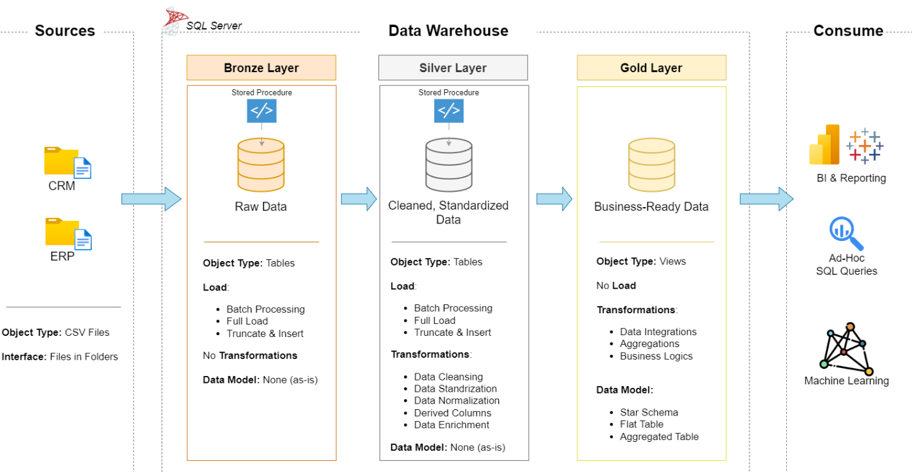

# Data Warehouse and Analytics Project

Welcome to my **Data Warehouse and Analytics Project** repository! 🚀

This project showcases an end-to-end data warehousing and analytics solution — from building a modern data warehouse to generating actionable business insights. Built as a personal portfolio project, it reflects industry best practices in data engineering and data analytics.

---

## 🏗️ Data Architecture

The data architecture for this project follows the **Medallion Architecture**, made up of **Bronze**, **Silver**, and **Gold** layers:



1. **Bronze Layer** — Stores raw data exactly as received from the source systems. Data is ingested from CSV files into a SQL Server database.
2. **Silver Layer** — Cleanses, standardizes, and normalizes the raw data to prepare it for analysis.
3. **Gold Layer** — Houses business-ready data, modeled into a star schema optimized for reporting and analytics.

---

## 📖 Project Overview

This project covers:

1. **Data Architecture** — Designing a modern data warehouse using the Bronze, Silver, and Gold layered approach.
2. **ETL Pipelines** — Extracting, transforming, and loading data from source systems into the warehouse.
3. **Data Modeling** — Building fact and dimension tables optimized for analytical queries.
4. **Analytics & Reporting** — Writing SQL-based reports to generate actionable insights.

🎯 This repository demonstrates hands-on skills in:
- SQL Development
- Data Architecture
- Data Engineering
- ETL Pipeline Development
- Data Modeling
- Data Analytics

---

## 🛠️ Tools & Resources

- **[Datasets](datasets/)** — Project dataset (CSV files)
- **[SQL Server Express](https://www.microsoft.com/en-us/sql-server/sql-server-downloads)** — Lightweight server for hosting the database
- **[SQL Server Management Studio (SSMS)](https://learn.microsoft.com/en-us/sql/ssms/download-sql-server-management-studio-ssms?view=sql-server-ver16)** — GUI for managing and querying the database
- **[Git & GitHub](https://github.com/)** — Version control and project hosting
- **[Draw.io](https://www.drawio.com/)** — Designing data architecture, models, and flow diagrams
- **[Notion](https://www.notion.so/)** — Project planning and task tracking

---

## 🚀 Project Requirements

### Building the Data Warehouse (Data Engineering)

#### Objective
Develop a modern data warehouse using SQL Server to consolidate sales data, enabling analytical reporting and informed decision-making.

#### Specifications
- **Data Sources**: Import data from two source systems (ERP and CRM) provided as CSV files.
- **Data Quality**: Cleanse and resolve data quality issues prior to analysis.
- **Integration**: Combine both sources into a single, user-friendly data model designed for analytical queries.
- **Scope**: Focus on the latest dataset only; historization of data is not required.
- **Documentation**: Provide clear documentation of the data model to support both business stakeholders and analytics teams.

---

### BI: Analytics & Reporting (Data Analysis)

#### Objective
Develop SQL-based analytics to deliver detailed insights into:
- **Customer Behavior**
- **Product Performance**
- **Sales Trends**

These insights help stakeholders track key business metrics and support data-driven decision-making.

For more details, refer to [docs/requirements.md](docs/requirements.md).

---

## 📂 Repository Structure

```
data-warehouse-analytics-project/
│
├── datasets/                           # Raw datasets used for the project (ERP and CRM data)
│
├── docs/                               # Project documentation and architecture details
│   ├── etl.drawio                      # Draw.io file showing ETL techniques and methods
│   ├── data_architecture.drawio        # Draw.io file showing the project's architecture
│   ├── data_catalog.md                 # Catalog of datasets, including field descriptions and metadata
│   ├── data_flow.drawio                # Draw.io file for the data flow diagram
│   ├── data_models.drawio              # Draw.io file for data models (star schema)
│   ├── naming-conventions.md           # Naming guidelines for tables, columns, and files
│
├── scripts/                            # SQL scripts for ETL and transformations
│   ├── bronze/                         # Scripts for extracting and loading raw data
│   ├── silver/                         # Scripts for cleaning and transforming data
│   ├── gold/                           # Scripts for creating analytical models
│
├── tests/                              # Test scripts and data quality checks
│
├── README.md                           # Project overview and instructions
├── LICENSE                             # License information for the repository
├── .gitignore                          # Files and directories ignored by Git
└── requirements.txt                    # Dependencies and requirements for the project
```

---

## 🛡️ License

This project is licensed under the [MIT License](LICENSE). You are free to use, modify, and share this project with proper attribution.

---

## 🌟 About Me

Hi there! I'm **Nandani Khalas**, a final-year B.Tech Computer Engineering student passionate about data engineering and data analytics. I enjoy turning raw, messy data into clean, reliable insights, and I built this project to apply and showcase industry-standard data warehousing practices.

📫 Let's connect:

[](https://www.linkedin.com/in/nandani-khalas)
[](https://github.com/Nandani-Pritiben)
